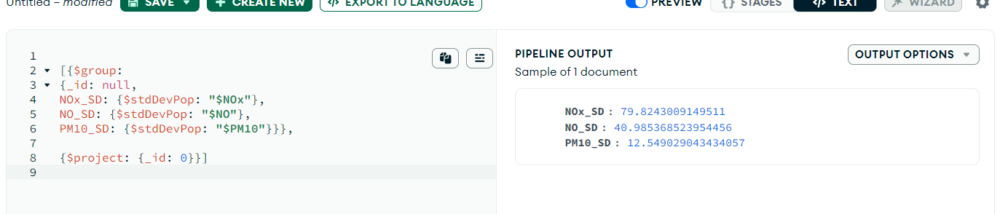
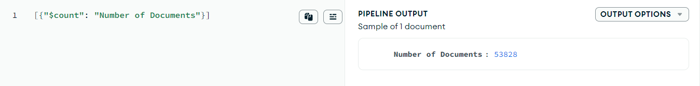
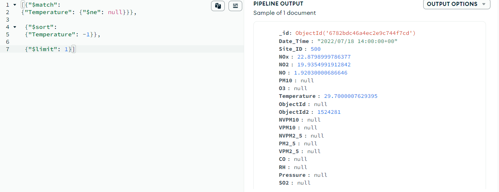

# NoSQL Database implementation

For modelling the data in a NoSQL database I decided to use MongoDB as I believed a document-based model would fit our measurement orientated data well. The data relating to a single measurement was previously stored as single record and I intend to store them as individual documents in our NoSQL model. This means in terms of normalisation/denormalisation there is little change here. 

The rest of the data, that being the data which describes the sites, will also be stored as single documents. If we recall, site information was previously split across 3 tables in my relational database model. This kind of denormalisation makes reading much faster since join commands are no longer needed. Moreover, since this data is historical, there can seldom be much need for updating it. 

Having said that, we should note that  Bristol city council has recently redrawn some of its council borders and council elections happen on a regular basis. While new measurements are very easy to insert as single documents, I would recommend extending the site documents to include some kind of date  range to account for changing MP's and then a new site document can be added for every council election - that is if the model was implemented for the full data set. As set out in the task specification, my model will only be for one station, that being "Temple Way" (Site ID 500). 

## Data Filtering, Cropping and Cleaning

First, I constructed the site information for the Temple Way site manually in JSON and then inserted it into our database.

**Site Information:**
```JSON
{
  "_id": {
    "$oid": "6782ca126a4ec2e9c745e473"
  },
  "Site_ID": 500,
  "SiteName": "Temple Way",
  "Latitude": 51.4579497132,
  "Longitude": -2.5839890903,
  "ConstituencyName": "Bristol West",
  "MPName": "Thangam Debbonaire"
}
```
I next import the csv dataset that was previously cropped in task 3, here each measurement record automatically creates a document. I took the first document to appear as an example below.

**Example Document:**
```JSON
{
  "_id": {
    "$oid": "6782bd946a4ec2e9c73df2ad"
  },
  "Date_Time": "2019/07/01 07:00:00+00",
  "Site_ID": 500,
  "NOx": 44.2434997558594,
  "NO2": 24.6081008911133,
  "NO": 12.8058996200562,
  "PM10": 12.5609998703003,
  "O3": {
    "$numberDouble": "NaN"
  },
  "Temperature": 13.5,
  "ObjectId": "",
  "ObjectId2": 197,
  "NVPM10": {
    "$numberDouble": "NaN"
  },
  "VPM10": {
    "$numberDouble": "NaN"
  },
  "NVPM2_5": {
    "$numberDouble": "NaN"
  },
  "PM2_5": {
    "$numberDouble": "NaN"
  },
  "VPM2_5": {
    "$numberDouble": "NaN"
  },
  "CO": "",
  "RH": {
    "$numberDouble": "NaN"
  },
  "Pressure": "",
  "SO2": ""
}
```
Before doing any further cleaning, I first filtered out all documents for sites other than 500.

**Site Filter:**
```JSON
{Site_ID: {$ne: 500}} 
```
And then subsequently removed them from the database.

Notice in the example the mixture of *NaN* and *""* (empty) values for some of the fields. Here the csv file had a null or empty value and this is how they came into MongoDB.
To ensure they appear in MongoDB as true null values within its system I considered editing the csv file in python and then reuploading the data 
but I opted to instead use MongoDB’s shell (mongosh). I chose this because it would be more straightforward to interact with the data directly 
in the database.

Here using the *updateMany* command I updated each field individually for the whole data set based off my observed null inconsistencies:

**Null Value Updates:**
```JSON
db.measurement.updateMany({Pressure: ''},{$set: {Pressure: null}})
db.measurement.updateMany({SO2: ''},{$set: {SO2: null}})
db.measurement.updateMany({CO: ''},{$set: {CO: null}})
db.measurement.updateMany({PM10: ''},{$set: {PM10: null}})
db.measurement.updateMany({ObjectId: ''},{$set: {ObjectId: null}})

db.measurement.updateMany({RH: NaN},{$set: {RH: null}})
db.measurement.updateMany({O3: NaN},{$set: {O3: null}})
db.measurement.updateMany({NVPM10: NaN},{$set: {NVPM10: null}})
db.measurement.updateMany({VPM10: NaN},{$set: {VPM10: null}})
db.measurement.updateMany({NVPM2_5: NaN},{$set: {NVPM2_5: null}})
db.measurement.updateMany({VPM2_5: NaN},{$set: {VPM2_5: null}})
db.measurement.updateMany({PM2_5: NaN},{$set: {PM2_5: null}})
```
Following this, we can see that the example document is much cleaner:

**Updated Example Document:**
```JSON
{
  "_id": {
    "$oid": "6782bd946a4ec2e9c73df2ad"
  },
  "Date_Time": "2019/07/01 07:00:00+00",
  "Site_ID": 500,
  "NOx": 44.2434997558594,
  "NO2": 24.6081008911133,
  "NO": 12.8058996200562,
  "PM10": 12.5609998703003,
  "O3": null,
  "Temperature": 13.5,
  "ObjectId": null,
  "ObjectId2": 197,
  "NVPM10": null,
  "VPM10": null,
  "NVPM2_5": null,
  "PM2_5": null,
  "VPM2_5": null,
  "CO": null,
  "RH": null,
  "Pressure": null,
  "SO2": null
}
```
To check that there are no documents with inconsistent null values I ran the following query and found actually there were still null  inconsistencies which were not apparent from the first document.

**Null Value Search:**
```JSON
{$or: [{PM2_5: {$in: ["", NaN]}},{NO: {$in: ["", NaN]}},{Temperature: {$in: ["", NaN]}},{O3: {$in: ["", NaN]}},
       {ObjectId: {$in: ["", NaN]}},{CO: {$in: ["", NaN]}},{Pressure: {$in: ["", NaN]}},{Date_Time: {$in: ["", NaN]}},
       {NO2: {$in: ["", NaN]}},{ObjectId2: {$in: ["", NaN]}},{NVPM2_5: {$in: ["", NaN]}},{VPM10: {$in: ["", NaN]}},
       {NOx: {$in: ["", NaN]}},{RH: {$in: ["", NaN]}},{Site_ID: {$in: ["", NaN]}},{SO2: {$in: ["", NaN]}},
       {PM10: {$in: ["", NaN]}},{VPM2_5: {$in: ["", NaN]}},{NVPM10: {$in: ["", NaN]}}]}
```
I then updated these null values in a similar fashion to before and re-run the query above to check all null values were consistent,
which they now were.

**Final Null Value Updates:**
```JSON
db.measurement.updateMany({PM10: NaN},{$set: {PM10: null}})
db.measurement.updateMany({Temperature: NaN},{$set: {Temperature: null}})
db.measurement.updateMany({NOx: NaN},{$set: {NOx: null}})
db.measurement.updateMany({NO2: NaN},{$set: {NO2: null}})
db.measurement.updateMany({NO: NaN},{$set: {NO: null}})
```

Now that the data was consistent, I built some queries to demonstrate the capabilities of the model:

## Sample Queries

**1** - Find and then calculate the standard deviation for NO, NOx and NO2:



**2** - Find the total number of documents in our collection:



**3** - Fetch the document for the recording with the highest temperature:



As demonstrated, the model can retrieve documents as well as process them to gain further insight into the dataset.

(Word Count: 888)

